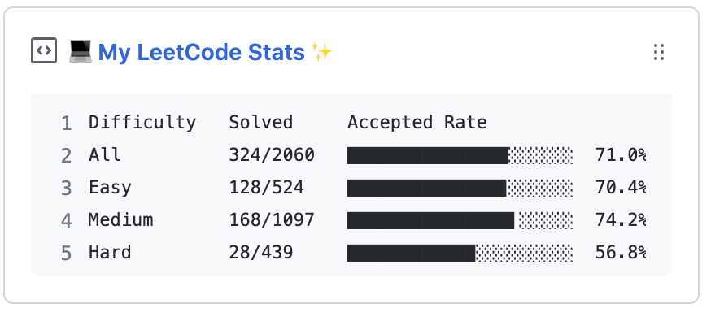

  
  <h3 align="center">leetcode-box</h3>
  
Update a pinned gist to show your LeetCode stats.

---
> 📌✨ For more pinned-gist projects like this one, check out: <https://github.com/matchai/awesome-pinned-gists>

## Prep Work

1. Create a new public GitHub Gist (https://gist.github.com/)
2. Create a token with the `gist` scope and copy it. (https://github.com/settings/tokens/new)
3. Find the username from your LeetCode profile `https://leetcode.com/{username}`

## Project Setup

1. Fork this repository
2. Go to your fork's `Settings` > `Secrets` > `Add a new secret` for each environment secret:
   - **`GIST_ID`:** 32 bits ID from your gist URL 
     >`https://gist.github.com/{github_username}/`**`762ebda9730630395aabdee06ce58fd1`**.
   - **`GH_TOKEN`:** The GitHub token generated above.
   - **`LEETCODE_USERNAME`:** Your LeetCode Username